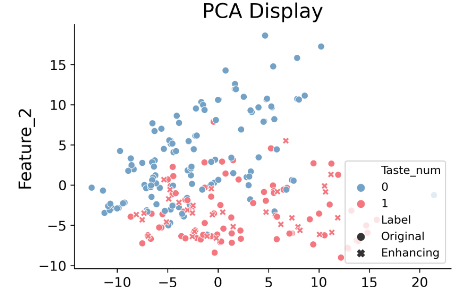
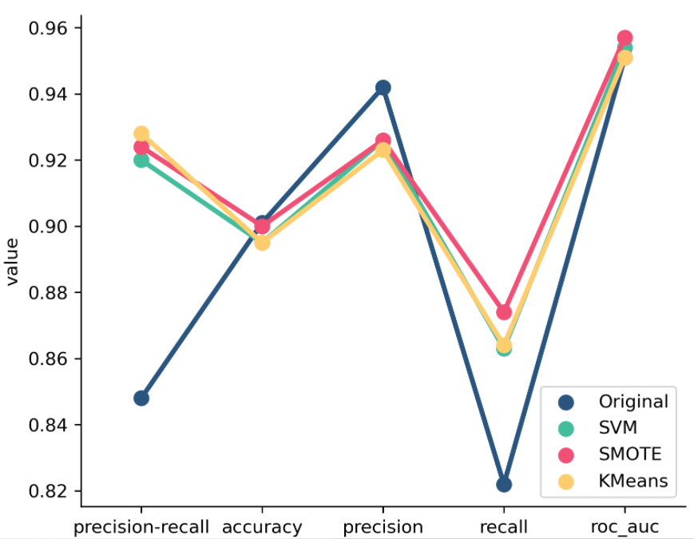
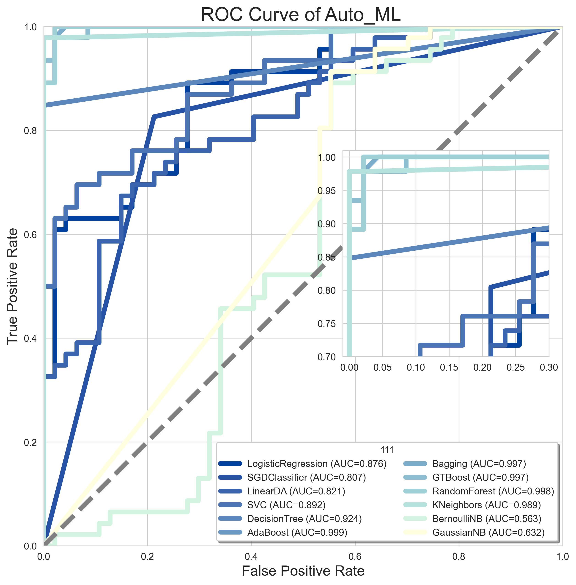
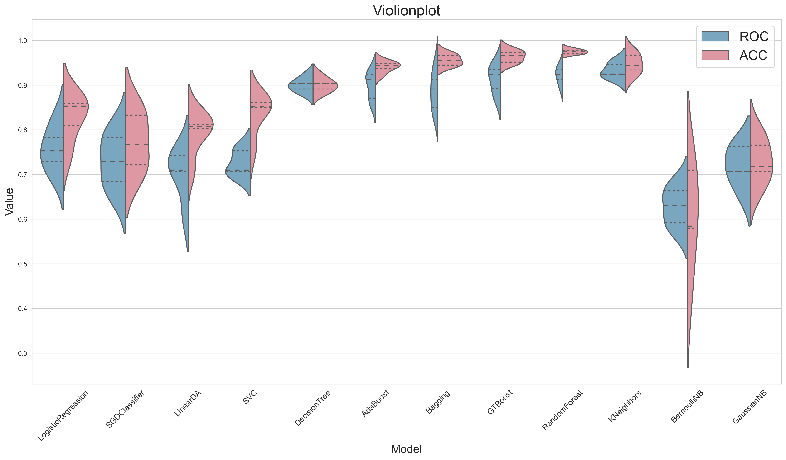

**Auto_ML_C 0.0.12**

# Illustrate：

​	这是崔连山和小伙伴们的机器学习拓展包，代有浓厚的社会主义开源分享精神，极富创造力和战斗力。在这里让我们为他们鼓掌 :clinking_glasses:

​	This is a machine learning expansion package for Cui Lianshan and his friends. It has a strong socialist open source sharing spirit, and is extremely creative and combat effective. Let us applaud them here :clinking_glasses:

## Spend

测试集数据位置 Test set data location ：{Example}

The configuration is as follows:

|      | Windows     | Windows     | MacOS | Linux        |
| ---- | ----------- | ----------- | ----- | ------------ |
| 型号 | i7-9750H    | i7-9750H    | M1    | E5-2640 V4   |
| 核心 | 6核心12线程 | 6核心12线程 | 8核心 | 20核心40线程 |
| 频率 | 2.67GHz     | 3.2GHz      |       | 2.40GHz      |

运行速度对比结果如下：

| Unwrapped function  | Windows1 | Windows2  | MacOS      | Linux      |
| ------------------- | -------- | --------- | ---------- | ---------- |
| ALL_FUNCTION        | 47.364   | 43.681    | 34.013     | ==27.282== |
| binary_ROC()        | 45.809   | 42.964    | 32.751     | ==32.143== |
| auto_model()        | 53.498   | 48.649    | ==38.267== | 40.794     |
| estimator_violion() | 1.191    | ==1.021== | 1.678      | 2.395      |

The running speed comparison results are as follows:

| Wrapper function    | Windows1 | Windows2              | MacOS                                                        | Linux                                                        |
| ------------------- | -------- | --------------------- | ------------------------------------------------------------ | ------------------------------------------------------------ |
| binary_ROC()        | 46.2 s   | 43.2 s                | CPU times: user 4.82 s, sys: 365 ms, total: 5.18 s Wall time: ==32.9s== | CPU times: user 9.59 s, sys: 3.89 s, total: 13.5 s Wall time: 33.3 s |
| auto_model()        | 50.4 s   | 47.1 s                | CPU times: user 9.75 s, sys: 247 ms, total: 10 s Wall time: ==38.1 s== | CPU times: user 15.1 s, sys: 1.68 s, total: 16.8 s Wall time: 41.1 s |
| estimator_violion() | 1.16 s   | Wall time: ==1.01 s== | CPU times: user 2.02 s, sys: 70.1 ms, total: 2.09 s Wall time: 1.69 s | CPU times: user 3.85 s, sys: 2.32 s, total: 6.17 s Wall time: 2.23 s |

## Request_install

You can refer to learning the environment backup in the current directory: Auto_ML_C.yaml

| Package          | Minimum version-to be tested |
| ---------------- | ---------------------------- |
| python=3.8.10    |                              |
| seaborn=0.11.2   |                              |
| pandas=1.3.3     |                              |
| matplotlib=3.4.2 |                              |
| numpy=1.20.3     |                              |


# Content:

​    该包是基于Sklearn，imblance等机器学习拓展包之上的Package，共计划分为两个部分，
​	This package is based on Sklearn, imblance and other machine learning expansion packages. It is planned to be divided into two parts.

- Classification task

  1. binary_classfication.py

     The internal available functions are as follows 内部可用函数如下

     | 函数名                                                       | 功能                                                         | 返回值                                                |
     | ------------------------------------------------------------ | ------------------------------------------------------------ | ----------------------------------------------------- |
     | cal_add_1(num1,num2):wave:                                   | 简单的欢迎函数                                               | num1,num2                                             |
     | LogisticRegressionCV_mdoel(X, Y,cv)                          |                                                              |                                                       |
     | SGDClassifier_model(X,Y,cv)                                  |                                                              |                                                       |
     | LinearDiscriminantAnalysis_model(X, Y,cv)                    |                                                              |                                                       |
     | LinearSVC_model(X, Y,cv)                                     |                                                              |                                                       |
     | SVC_model(X, Y,cv)                                           |                                                              |                                                       |
     | DecisionTreeClassifier_model(X,Y,cv)                         |                                                              |                                                       |
     | AdaBoostClassifier_model(X,Y,cv)                             |                                                              |                                                       |
     | BaggingClassifier_model(X, Y,cv)                             |                                                              |                                                       |
     | GradientBoostingClassifier_model(X, Y,cv)                    |                                                              |                                                       |
     | RandomForestClassifier_model(X, Y,cv)                        |                                                              |                                                       |
     | KNeighborsClassifier_model(X, Y,cv)                          |                                                              |                                                       |
     | BernoulliNB_model(X, Y,cv)                                   |                                                              |                                                       |
     | GaussianNB_model(X,Y,cv)                                     |                                                              |                                                       |
     | 下面是总函数                                                 |                                                              |                                                       |
     | binary_ROC(X,Y,k,fig_name)                                   | Plot the best ROC under scalar hyperparameter search         | fig                                                   |
     | auto_model(X, Y, k)Model's scalar hyperparameter search results |                                                              | Auc_data, Acc_data, <br />Recall_data, Precision_data |
     | estimator_violion(df1,df2,fig_name)                          | Draw a violin chart for the Dataframe of the auto_model result | fig                                                   |
     
     
     
     
     
  3. Multi-class function
     
     等待
     
  3. Feature selection function Feature_struction
  
     | Function                                                    | Function                                                     | return value          |
     | ----------------------------------------------------------- | ------------------------------------------------------------ | --------------------- |
     | data_enhance_show(X,Y[["Taste_num"]],location,kind="SMOTE") | 多种可视化方法进行降维可视化待增强数据<br />A variety of visualization methods to reduce dimensionality to visualize the data to be enhanced | Deduplicate DataFrame |
     | data_enhance(X.iloc[:,:-1],Y[["Taste_num"]])                | 采用多指标评价不同增强方法后的结果<br />Using multiple indicators to evaluate the results of different enhancement methods | Rating DataFrame      |
     | data_enhance_compare(tmp1,location,name)                    | 可视化函数2的返回结果<br />Visualize the return result of function 2 | 图片 Fig              |
  
     
  
  4. 超参数优化的进度条版本！！！！ 下次一定系列！
     Super parameter optimization progress bar display function! ! ! ! Update focus of the next version


# How to Use

## Installation

```python
# Method 1
# Create a new environment, here is conda as an example
conda create --name Auto_ML_C python=3.8.10

# Activate the newly created environment
conda activate Auto_ML_C

# Installation package
pip install Auto_ML_C==0.0.11
pip install imblearn

# Suggest the pipeline of Jupyter notebook [optional, recommended]
conda install jupyter notebook
conda install ipykernel 
python -m ipykernel install --user --name Auto_ML_C --display-name   "Auto_ML_C"
# Install Sklearn 0.6.  this will fixed next version
conda install -c conda-forge sklearn-contrib-lightning

# Method2
# Use the yaml environment file on the GitHub homepage to directly copy the current environment
conda env create -n Auto_ML_C -f Auto_ML_C.yaml

# Activate the newly created environment
conda activate 

# Suggest the pipeline of Jupyter notebook [optional, recommended]
conda install jupyter notebook
conda install ipykernel 
python -m ipykernel install --user --name Auto_ML_C --display-name   "Auto_ML_C"
```


## Feature_struction

```python
import auto_ml_c.Feature_structure as fs
import pandas as pd
df = pd.read_csv("1_23肽全部的构效数据.csv")
X = df.iloc[:,2:]
Y = df[["Taste"]]
Y["Taste_num"] = 10
for i in range(Y.shape[0]):
    if Y["Taste"].iloc[i] == "Umami":
        Y["Taste_num"].iloc[i] = 1
    elif Y["Taste"].iloc[i] == "Bitter":
        Y["Taste_num"].iloc[i] = 0
        
# Function 1: Use a variety of visualization methods to reduce dimensionality to visualize the data to be enhanced       
# 函数1： 采用多种可视化方法进行降维可视化待增强数据
location = ""
tmp = fs.data_enhance_show(X,Y[["Taste_num"]],location,kind="SMOTE")  
tmp

# Function 2: Using multiple indicators to evaluate the results of different enhancement methods
# 函数2： 采用多指标评价不同增强方法后的结果
tmp1 = fs.data_enhance(X.iloc[:,:-1],Y[["Taste_num"]])
tmp1

# Function 3: Visualize the return result of function 2
# 函数3：可视化函数2的返回结果
location = ""
name="Test"
tmp2 = fs.data_enhance_compare(tmp1,location,name)
tmp2
```







## Binary Classication

```python
# Here is an example of the function binary_classfication_ws  
# 这里以函数binary_classfication_ws举例

# 开始加载环境
import pandas as pd
import numpy as np
import auto_ml_c.binary_classfication as abc

# 读取测试数据
df = pd.read_csv("2_data_deal_smote.csv")
X = df.iloc[:,:-1]
Y = df["label"]
score = 'accuracy'

# The first function, draw ROC image
tmp_a = abc.binary_ROC(X,Y,cv,"111","accuracy")

# The second function, get Auc_data, Acc_data, Recall_data, Precision_data
tmp_b1,tmp_b2,tmp_b3,tmp_b4 = abc.auto_model(X,Y,cv,"accuracy")

# The third function, draw the evaluation graph obtained by function 2 auto_model
tmp_c = abc.estimator_violion(tmp_b1,tmp_b2,"Violionplot")
```






# ConTact

VX：Cuizy13390906310_ic

QQ：1776228595

E-mail：1776228595@qq.com

GitHub：https://github.com/SynchronyML/Auto_ML_C

